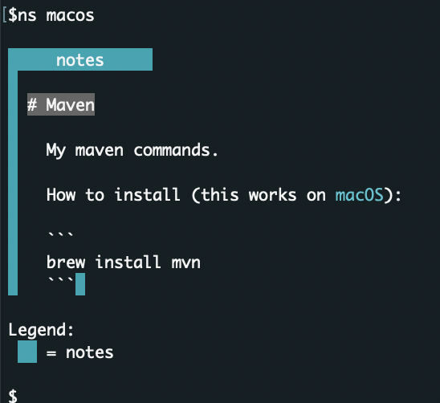

# Note search tool

This tool allows you to search the notes you have been collecting. 

# Getting started

This script expects a configuration file in the home directory of the user (`~/.note-search.cfg`). 

Example contents for `note-search.cfg`:

```
IGNORE_DIRS=
NOTES_DIR=/path/to/my/notebooks
```

This script works with a strictly defined directory structure and README.md files. 

Continuing from previous example for `note-search.cfg`, in `/path/to/my/notebooks` the directory and file structure is expected to be: 

```
notebooks
 topic1
  README.md
 topic2
  README.md
 ...
```

The contents of the README files is expected to be markdown formatted. Each section separated by heading is treated as a separate section when searching for the notes. If any part of a section matches the search string, the whole section is printed with matching parts highlighted. 




# Add note-search binary to path

Run the following script: 
```
(echo; echo '# Add note-search binary to path') >> $HOME/.zshrc
(echo 'export PATH=$PATH:~/w/note-search/bin/') >> $HOME/.zshrc
```

And restart shell. This example assumes `note-search` is located in `~/w`